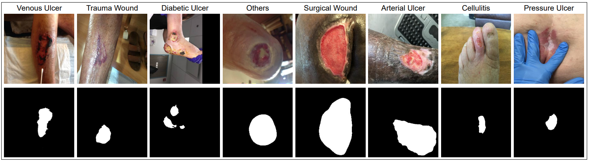

# WSNET
Wound Image Segmentation

[WSNet: Towards An Effective Method for Wound Image Segmentation](https://openaccess.thecvf.com/content/WACV2023/papers/Oota_WSNet_Towards_an_Effective_Method_for_Wound_Image_Segmentation_WACV_2023_paper.pdf), WACV-2023

[Wseg_dataset](https://iiitaphyd-my.sharepoint.com/:f:/g/personal/oota_subba_alumni_iiit_ac_in/ErP6STrF4FZMsxKF3hCmGM0BdiFFfYdaomIyNlnjEAh5ww?e=4Mmpux)

* Wound Segmentation dataset statistics:
* 2686 wound images
* 2686 masks correspodning to wound images
  
